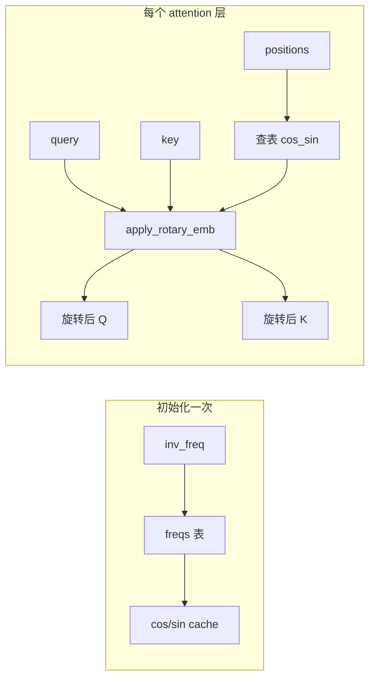

# 课程06：RoPE 旋转位置编码

> 用二维旋转把「位置」写进注意力里的 Q/K 向量里，让模型既懂相对距离，又能在推理时按位置查表高效应用。

## 本课目标

- 理解 RoPE（Rotary Position Embedding）的数学动机：为何用旋转、与绝对/相对位置编码的关系。
- 掌握复数视角与旋转矩阵视角的等价推导，并能对应到 `apply_rotary_emb` 的实现。
- 弄清 `inv_freq`、cos/sin 预计算缓存、`torch.compile` 与 `lru_cache` 在工程上的作用。
- 建立面试话术：RoPE 外推、NTK-aware、YaRN 等常见追问。

## 核心概念

### 1. 注意力里为什么需要位置信息

自注意力对 token 置换不变：打乱顺序若不改位置信息，输出不变。语言有序，因此必须在 Q、K（有时含 V）上注入位置。早期有绝对位置嵌入（加在输入上）；RoPE 则把位置编码进 Q、K 的**几何变换**里，并保持一定**相对性**。

### 2. RoPE 的核心思想（直观）

对每个位置 \(m\)，把 head 维度上的向量看成若干二维子空间上的向量，对每个子空间施加**依赖位置 \(m\) 的旋转**。这样，内积 \(\langle R_m q, R_n k\rangle\) 会自然依赖相对位置 \(m-n\)。

### 3. 二维旋转与复数

二维向量 \((x_1, x_2)\) 旋转 \(\theta\) 角：

\[
\begin{pmatrix} y_1 \\ y_2 \end{pmatrix}
=
\begin{pmatrix} \cos\theta & -\sin\theta \\ \sin\theta & \cos\theta \end{pmatrix}
\begin{pmatrix} x_1 \\ x_2 \end{pmatrix}
\]

等价地，把 \((x_1, x_2)\) 看成复数 \(x_1 + i x_2\)，旋转即乘以 \(e^{i\theta}\)。

对 RoPE，不同频率对应 head 内不同「子对」：第 \(j\) 对使用频率 \(\theta_j\)，位置 \(m\) 处相位为 \(m\theta_j\)。

### 4. inv\_freq 的含义

设 `rotary_dim = d`，通常取偶数维，按对处理。第 \(j\) 个频率（代码里 `arange(0, rotary_dim, 2)` 给出 \(j=0,1,\ldots\)）：

\[
\theta_j = \mathrm{base}^{-2j/d}
\]

即 `inv_freq[j] = 1 / base^(2j/d)`。位置 \(t\) 上该频率的相位为 \(t \cdot \theta_j\)（代码用 `einsum("i,j->ij", t, inv_freq)` 对所有位置、所有频率一次性算完）。

`base`（如 10000）控制频率谱：高频分量编码细粒度相对位置，低频对应长程模式。

### 5. 为何缓存 cos/sin

对每个 `(position, freq)` 都要 \(\cos(t\theta_j)\)、\(\sin(t\theta_j)\)。推理时同一位置会被大量重复查询；预先算好 `[max_position, 1, rotary_dim]` 的 cache（cos 与 sin 在最后一维拼接），前向只做索引 `cos_sin_cache[positions]`，避免重复三角函数与广播开销。

### 6. torch.compile 与 lru_cache（工程视角）

- **`@torch.compile`（加在 `RotaryEmbedding.forward`）**：把 forward 编成更高效的融合内核路径，减少 Python 调度开销；与静态形状的 RoPE 查表+chunk 很契合。
- **`@lru_cache(1)` 的 `get_rope`**：同一 `(head_size, rotary_dim, max_position, base)` 只构造**一份** `RotaryEmbedding` 模块实例，避免每层重复创建与重复 buffer，是典型的**单例式工厂**（注意：`rope_scaling` 被断言为 `None`，本实现未做缩放类 RoPE）。

---

## 源码解析

以下对应 nano-vllm 中 `rotary_embedding.py` 的核心逻辑。

### `apply_rotary_emb` 逐行

```python
def apply_rotary_emb(x, cos, sin):
    x1, x2 = torch.chunk(x.float(), 2, dim=-1)
    y1 = x1 * cos - x2 * sin
    y2 = x2 * cos + x1 * sin
    return torch.cat((y1, y2), dim=-1).to(x.dtype)
```

- **`chunk(..., 2, dim=-1)`**：把最后一维拆成两半，对应二维旋转的两分量（实部/虚部或 \(x_1,x_2\)）。
- **`y1, y2`**：即旋转矩阵乘法  
  \(\begin{smallmatrix}\cos&-\sin\\ \sin&\cos\end{smallmatrix}\) 作用在 \((x_1,x_2)\) 上。
- **`.float()`**：三角函数与旋转在 float32 上更稳，最后再 `.to(x.dtype)` 回到 fp16/bf16，与混合精度训练/推理一致。

### `RotaryEmbedding.__init__`

- `assert rotary_dim == head_size`：本实现要求整头维度都参与 RoPE（无部分维度不旋转的变体）。
- `inv_freq`：见上文公式。
- `freqs = einsum(t, inv_freq)`：形状 `[max_position, rotary_dim/2]`，每个位置一行、每个频率一列。
- `cos`, `sin` 后与 `torch.cat((cos, sin), dim=-1)`：最后一维长度为 `rotary_dim`，前半 cos、后半 sin；`unsqueeze_(1)` 为与 head 维广播预留维度。
- `register_buffer(..., persistent=False)`：随模型设备移动，默认不写入 checkpoint（因可完全由超参重建）。

### `forward`

- `cos_sin = self.cos_sin_cache[positions]`：`positions` 为当前 batch 各 token 的位置 id，支持非连续位置（如解码步）。
- `cos, sin = cos_sin.chunk(2, dim=-1)`：与初始化时拼接顺序对应。
- 对 `query`、`key` 各调用 `apply_rotary_emb`，**只旋 Q/K**，值向量 `v` 通常不旋（标准 RoPE 做法）。

### `get_rope`

- `lru_cache(1)`：缓存最近一次参数组合的构造结果；实际工程中 head 配置固定时等价全局单例。
- `assert rope_scaling is None`：动态 NTK/YaRN 等需改 inv\_freq 或插值逻辑，此处未实现。

---

## 图解

### RoPE 信息流（简化）



### 二维块旋转（最后一维一对）

```text
  [..., x1 | x2, ...]  --chunk-->  x1, x2
         |                            |
         v                            v
    cos,sin (按位置广播)      y1 = x1*cos - x2*sin
                              y2 = x2*cos + x1*sin
         |                            |
         +-------- cat ----------->  [..., y1 | y2, ...]
```

---

## 面试考点

### RoPE 与相对位置

RoPE 使 \(\langle R_m q, R_n k\rangle\) 依赖 \(m-n\) 形式的相对结构（在标准设定下），这是其被广泛用于 LLaMA/Qwen 等的原因。

### 外推（Extrapolation）

训练最大长度 \(L_{\mathrm{train}}\)，测试 \(L_{\mathrm{test}} > L_{\mathrm{train}}\) 时，未见过的高位置索引上，固定 base 的相位分布与训练分布不一致，注意力分数分布偏移 → **外推性能下降**。

### NTK-aware（思想）

通过**在更长上下文上重新缩放 base 或频率**，使高频分量变化更慢，缓解外推时「频率谱与训练不匹配」。实现上常改 `inv_freq` 计算或引入缩放因子，需与训练配置区分。

### YaRN（思想）

结合 **NTK 式插值**与 **注意力温度/截断**等策略，在扩展上下文时同时兼顾近距与远距行为；属于工程上常用的长上下文方案族。

### 本源码简答题

- 为何 `rotary_dim == head_size`？本文件假设全头旋转，简化实现。
- 为何 cos/sin 不随 batch 现算？推理热点路径，查表更省。
- `torch.compile` 可能带来啥问题？动态形状极端变化时重编译；需实测。

---

## 常见面试题

1. **RoPE 和绝对位置嵌入比优缺点？**  
   RoPE 融入 Q/K 内积的几何结构，相对位置性质更清晰；绝对嵌入实现简单但泛化到更长序列时常不如良好调参的 RoPE。

2. **为什么一般只给 Q、K 加 RoPE？**  
   标准推导中旋转作用于 query/key 以编码相对位置关系；value 保持不旋转是常见且有效的设定。

3. **base 取 10000 意味着什么？**  
   控制各维度旋转快慢的指数分布；越大通常越偏低频，影响可建模的波长与长程依赖。

4. **如何向面试官解释 inv\_freq 那一行？**  
   为每一对维度指定一个几何级数的角速度，使多尺度位置模式可被叠加表示。

5. **长上下文扩展除了换模型还能讲什么？**  
   位置插值（PI）、NTK-aware、YaRN、窗口注意力等，并说明本仓库实现为「无 rope\_scaling 的基础 RoPE」。


---

## 小结

RoPE 把位置信息实现为 head 维上的分块二维旋转；`inv_freq` 定义多尺度角速度；cos/sin 表避免重复计算；`torch.compile` 与 `lru_cache` 分别优化前向与模块单例。面试追问长上下文时，把**外推失效原因**与 **NTK / YaRN 的思路**说清楚即可与工业界实践对齐。

### 手写伪代码速记（面试白板）

若面试官让你写 RoPE 核心，可只写：

1. 预计算 `inv_freq` 与每个位置 `t` 的 `freqs[t, j] = t * inv_freq[j]`；
2. `cos, sin` 后按对 `(x1,x2)` 做旋转；
3. Q、K 各旋一次再进 attention。

### 与 FlashAttention 的关系

**RoPE 通常在进入 FlashAttention 内核**之前**作用在 Q/K 张量上；内核内部只负责高效算 softmax(QKᵀ)V。若实现把 RoPE fused 进 CUDA kernel，属于进一步优化，与数学定义一致即可。**

（完）

---

## 下一课预告

下一课进入 **RMSNorm 与激活函数（含 SwiGLU / SiLU）**：看归一化如何稳定深层网络、残差如何与 RMSNorm 融合，以及门控前馈在 Qwen 类模型中的标准实现。
