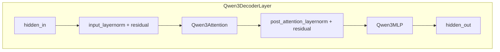

# 课程08：Qwen3 模型架构

> 以「解码器-only + GQA + 张量并行 + 融合线性层」组织起来的因果语言模型：embedding 进、层层 Self-Attn+MLP、最后 RMSNorm， logits 由 `lm_head` 单独算。

## 本课目标

- 能按数据流口述 **Qwen3Model / DecoderLayer / Attention / MLP** 各模块职责。
- 理解 **GQA（Grouped-Query Attention）**：`num_heads` 与 `num_kv_heads` 的关系及为何省 KV Cache。
- 理解 **`packed_modules_mapping`**：HuggingFace 拆分的 `q_proj/k_proj/...` 如何映射到 nano-vllm 的融合权重。
- 掌握 **Pre-Norm 残差**在本仓库中的写法（与 `RMSNorm` 双分支配合）。
- 解释 **`tie_word_embeddings`** 与 **`ParallelLMHead`** 在推理系统中的位置。

## 核心概念

### 1. 因果解码器（Decoder-only）总览

输入 `input_ids` → `embed_tokens` 得隐状态 → 重复 \(N\) 层 `Qwen3DecoderLayer` → 最终 `RMSNorm` →（在引擎别处或 `compute_logits`）`lm_head` 映射到词表 logits。

nano-vllm 中 `Qwen3ForCausalLM.forward` 只返回 **最后一层隐状态**，与部分框架「forward 直接返回 logits」不同，需注意 **logits 由 `compute_logits` 单独调用** 的设计。

### 2. 张量并行（TP）下的头数

```text
tp_size = dist.get_world_size()
num_heads = total_num_heads // tp_size
num_kv_heads = total_num_kv_heads // tp_size
```

每个 rank 只持有 **本分片** 的 Q 头与 KV 头；`assert total % tp_size == 0` 保证整除。面试问「为何能整除」：模型配置与 TP 度数需预先匹配。

### 3. GQA：多 Query 头共享少量 KV 头

设 **总**注意力头数为 \(H\)，KV 头数为 \(H_{kv}\)，且 \(H_{kv} \mid H\)（通常 \(H_{kv} \le H\)）。

- **MHA**：\(H_{kv} = H\)，每头独立 K、V。
- **GQA**：\(H_{kv} < H\)，多个 Q 头复用同一组 K/V（在实现上常通过广播或重复索引完成）。

**收益**：KV Cache 与 K/V 投影参数量按 \(H_{kv}/H\) 比例下降，长上下文推理更省显存与带宽。

本仓库 `Attention` 模块接收 `num_heads` 与 `num_kv_heads`，内部实现广播/分组逻辑（见 `attention.py`，本课不展开）。

### 4. QKV 融合线性层 `QKVParallelLinear`

单次矩阵乘从 `hidden_size` 映射到：

\[
\text{out\_dim} = (H \cdot d) + 2 \cdot (H_{kv} \cdot d)
\]

即 **Q 总长 + K 总长 + V 总长**，再 `split` 成三段。好处：一次 GEMM、更好利用 Tensor Core、减少权重碎片。

### 5. Q/K 上的 RMSNorm（无 qkv_bias 时）

```text
if not self.qkv_bias:
    self.q_norm = RMSNorm(self.head_dim, ...)
    self.k_norm = RMSNorm(self.head_dim, ...)
```

这是 **Qwen3 系列在「无 bias」配置下对 Q、K 做 per-head 归一化** 的常见变体（与具体 checkpoint 对齐；面试提到「提高训练稳定性/与官方实现对齐」即可）。

### 6. RoPE 与缩放

```text
self.scaling = head_dim ** -0.5
self.rotary_emb = get_rope(head_dim, ..., base=rope_theta, ...)
```

- `scaling`：\(\frac{1}{\sqrt{d_h}}\) 用于 attention logits 缩放。
- `rope_theta`：来自 config（源码默认可能到 `1000000` 等量级，以 HuggingFace `Qwen3Config` 为准）。

### 7. MLP：SwiGLU + 列并行 + 行并行

- `MergedColumnParallelLinear(hidden, [intermediate]*2)`：**门控与上投影** 合并为一层宽矩阵。
- `SiluAndMul`：SiLU 门控乘。
- `RowParallelLinear`：下投影汇总各 TP rank。

### 8. `packed_modules_mapping` 与权重加载

HuggingFace 习惯 **拆开** `q_proj, k_proj, v_proj` 与 `gate_proj, up_proj`。nano-vllm 为性能 **融合** 成 `qkv_proj` 与 `gate_up_proj`。加载时需提供 **名字映射**，告诉 loader 如何把 HF 张量 **拼接/切片** 到融合层。

映射表语义（示例）：

- `"q_proj": ("qkv_proj", "q")`：HF 的 `q_proj` 对应融合层里 Q 那一段。
- `"gate_proj": ("gate_up_proj", 0)`：第一段 gate。
- `"up_proj": ("gate_up_proj", 1)`：第二段 up。

具体切片规则在 `loader` 实现中（本课记**设计动机**即可）。

### 9. `tie_word_embeddings`

若 `config.tie_word_embeddings` 为真：

```text
self.lm_head.weight.data = self.model.embed_tokens.weight.data
```

**输入嵌入**与 **输出 logits 投影** 共享同一张权重矩阵，减少参数量，是 GPT 系常见设定。注意：并行切分下 `VocabParallelEmbedding` 与 `ParallelLMHead` 需支持共享存储语义。

---

## 源码解析

### `Qwen3Attention.forward`

1. `qkv = self.qkv_proj(hidden_states)`：一次线性得 QKV。
2. `split` 成 `q_size, kv_size, kv_size` 三段。
3. `view` 成 `[..., num_heads, head_dim]` 与 KV 头形状。
4. 可选 `q_norm` / `k_norm`。
5. `rotary_emb(positions, q, k)`：RoPE。
6. `self.attn(q, k, v)`：缩放点积注意力 + KV Cache（引擎侧）。
7. `o_proj`：多头合并回 `hidden_size`。

### `Qwen3DecoderLayer.forward`

- `input_layernorm`：第一层与后续层分支见课程07。
- `self_attn` → `post_attention_layernorm` → `mlp`。
- 返回 `(hidden_states, residual)` 供下一层继续。

### `Qwen3Model.forward`

- `residual = None` 初始化；每层更新。
- 最后 `norm(hidden_states, residual)` 结束残差链。

### `Qwen3ForCausalLM`

- `packed_modules_mapping`：类属性，供加载器使用。
- `compute_logits`：**推理解码循环**里在得到最后隐状态后计算词表分数。

---

## 图解

### 单层 Decoder（逻辑）



### GQA 示意（概念）

```text
Q:  head0 head1 head2 head3   (num_heads = 4)
K,V:  kv0        kv1           (num_kv_heads = 2)

映射: Q0,Q1 -> kv0 的 K,V
      Q2,Q3 -> kv1 的 K,V
（具体广播方式以实现为准）
```

### 权重映射（口头）

```text
HF:  q_proj | k_proj | v_proj     -->  nano: qkv_proj [ Q | K | V ]
HF:  gate_proj | up_proj          -->  nano: gate_up_proj [ gate | up ]
```

---

## 面试考点

### Pre-Norm vs Post-Norm

本实现为 **Pre-Norm**（归一化在子层前，残差绕过）。训练稳定性通常优于 Post-Norm（尤其在极深网络）。

### 为何有 `head_dim` 显式配置

部分模型 `hidden_size / num_heads` 非整除或配置与合并头维度特殊；`getattr(config, 'head_dim', None)` 允许覆盖默认推导。

### `qkv_bias` 与 Q/K Norm 的互斥呈现

源码：`if not self.qkv_bias` 才建 `q_norm/k_norm`。与具体模型配方一致，面试答「跟随官方 checkpoint 行为」。

### 推理系统中 `forward` 不返回 logits 的好处

- 解码循环可能只需 **最后 token** 隐状态再算 logits；
- 或批量时由 scheduler 统一调度 `compute_logits`，利于与采样器、CUDA Graph 等模块解耦。

---

## 常见面试题

1. **GQA 相对 MHA 的缺点？**  
   **表达力可能略降（共享 KV），但多数大模型通过增大宽度/层数补偿；推理收益显著。**

2. **为什么要融合 QKV 线性层？**  
   **减少 GEMM 次数、提高并行度、改善内存局部性。**

3. **`o_proj` 为何是 RowParallelLinear？**  
   Attention 输出在各头维度上 often 需 **行并行** 规约回完整 hidden（与张量并行设计一致，细节见 linear 实现）。

4. **`packed_modules_mapping` 解决什么问题？**  
   权重格式（HF）与推理引擎格式（融合层）不一致时的**自动化重排**。

5. **RoPE 的 `max_position` 从哪来？**  
   `config.max_position_embeddings`，与训练上下文长度相关。

6. **SiLU 为何在 MLP 里固定？**  
   `assert hidden_act == "silu"`：本实现只支持这一路径，与 Qwen3 SwiGLU 配方对齐。

---

## 小结

**Qwen3 在 nano-vllm 中的架构是标准 **Decoder-only**：GQA 降低 KV 开销，TP 切分 Q/KV 头，融合线性层配合 `packed_modules_mapping` 做权重映射，Pre-Norm 残差与 RMSNorm 深度耦合，`tie_word_embeddings` 可选共享输入输出嵌入。**面试时把 **数据流 + GQA 动机 + 映射表作用** 说清，通常已覆盖大部分考点。

## 下一课预告

下一课 **KV Cache 原理与实现**：从注意力重复计算出发，推导显存公式，并深入 `ModelRunner.allocate_kv_cache` 的块分配与张量形状。
